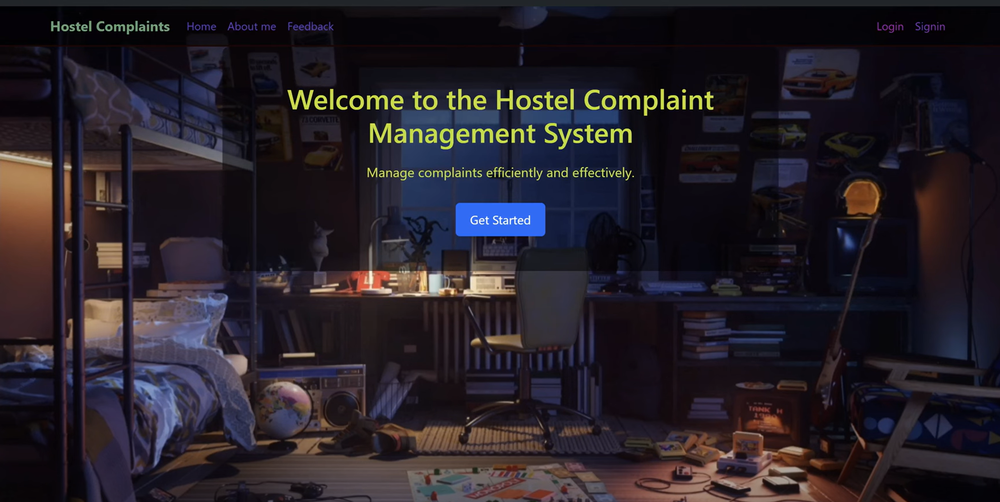
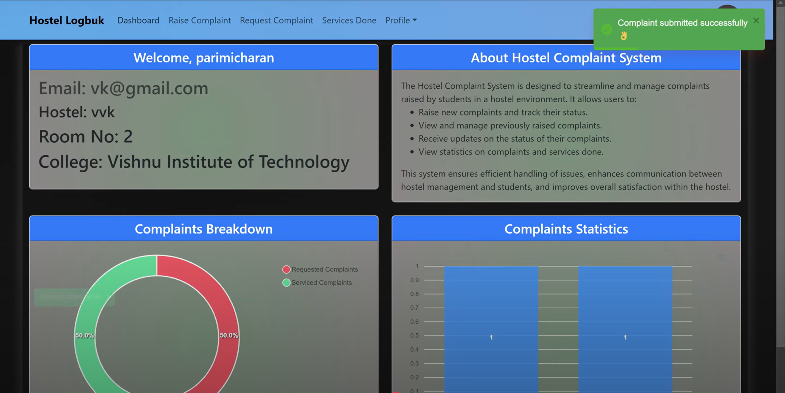
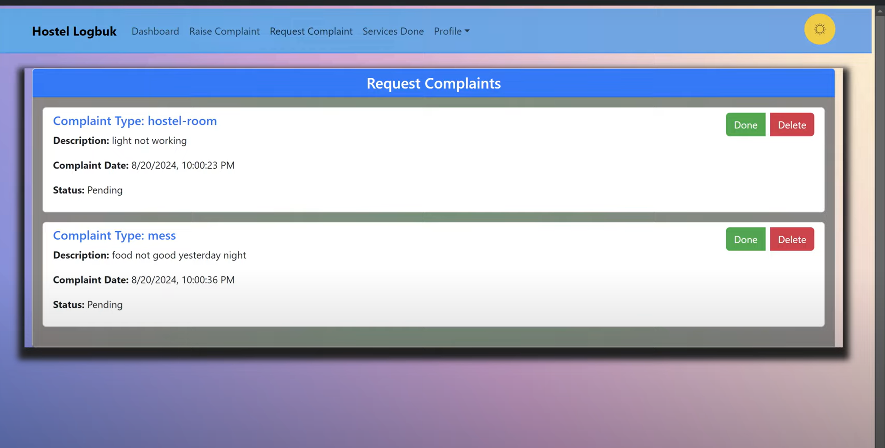

# Hostel Management System

## Overview
The **Hostel Management System** is a web application designed to streamline hostel operations, allowing students and administrators to manage hostel-related activities efficiently. The system provides role-based access for students and admins, ensuring smooth communication and operations.

<table>
  <tr>
    <th>🔹 Dashboard</th>
    <th>🔹 Student Interface</th>
    <th>🔹 Admin Interface</th>
  </tr>
  <tr>
    <td></td>
    <td></td>
    <td></td>
  </tr>
</table>

## Demo Video
Check out the **YouTube demo**: [Watch Here](https://www.youtube.com/watch?v=115JOXmdFKQ)

## Features
- **Student Dashboard**: View hostel details, request room changes, and manage personal information.
- **Admin Dashboard**: Manage student details, assign rooms, and track hostel activities.
- **Authentication**: Secure login and registration using JWT authentication.
- **Interactive UI**: Built with React and Tailwind CSS for a seamless user experience.
- **Data Management**: Uses MongoDB and Firebase for backend operations.
- **Charts & Analytics**: Visual representation of data using Chart.js and ApexCharts.
- **Real-time Notifications**: Integrated with React Toastify for instant alerts.

## Technologies Used
### Frontend
- **React** (18.3.1)
- **Tailwind CSS**
- **React Router DOM** (6.24.1)
- **Chart.js & React-Chartjs-2** (4.4.3, 5.2.0)
- **ApexCharts & React-ApexCharts** (3.51.0, 1.4.1)
- **Bootstrap & React Bootstrap** (5.3.3, 2.10.4)
- **Styled Components** (6.1.11)
- **Driver.js** (1.3.1) - For guided tours
- **React-Map-GL & Deck.GL** (7.1.7, 9.0.21) - For interactive maps
- **Axios** (1.7.2) - For API calls
- **React Toastify** (8.1.0) - For notifications

### Backend
- **Node.js & Express.js** (4.19.2)
- **MongoDB & Mongoose** (6.8.0, 8.5.1)
- **Firebase** - For authentication and database
- **JWT Authentication** (9.0.2)
- **Bcrypt.js** (2.4.3) - For password hashing
- **CORS & Dotenv** (2.8.5, 16.4.5)
- **Body Parser** (1.20.2)
- **Nodemon & Concurrently** (3.1.4, 8.2.2)

## Installation & Setup
### Prerequisites
Ensure you have **Node.js** and **MongoDB** installed on your machine.

### Clone Repository
```sh
 git clone https://github.com/charantejasparimi/hostel-management-system.git
 cd hostel-management-system
```

### Frontend Setup
```sh
 cd frontend
 npm install  # Install dependencies
 npm start    # Start the frontend server
```

### Backend Setup
```sh
 cd backend
 npm install  # Install dependencies
 npm start    # Start the backend server
```

### Environment Variables
Create a `.env` file in the backend directory and add:
```
MONGO_URI=your_mongodb_connection_string
JWT_SECRET=your_jwt_secret_key
FIREBASE_API_KEY=your_firebase_api_key
```


## Contributing
Feel free to contribute by creating a pull request or opening an issue.

## License
This project is licensed under the **MIT License**.

---
_Developed by Charan Tejas Parimi

